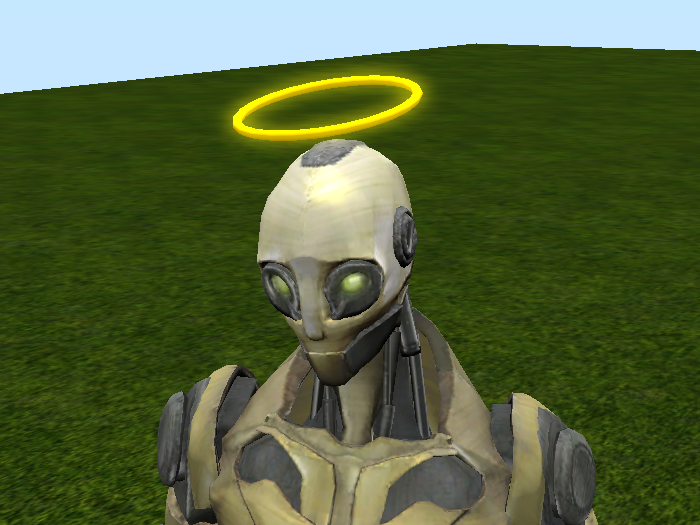
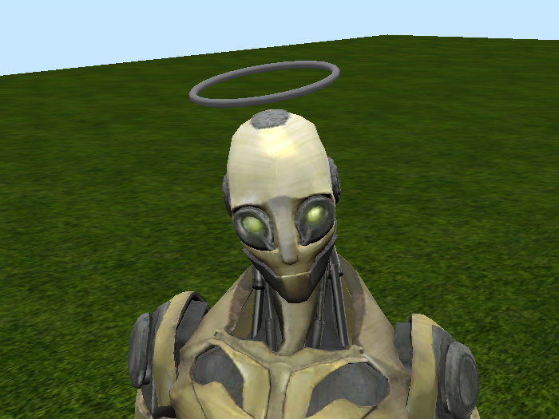

# Fourmilab Cloud Halo

[Fourmilab Cloud Halo](https://marketplace.secondlife.com/p/Fourmilab-Cloud-Halo/20555301)

As of the latter part of 2020, Second Life is in the process of
migrating from hosting on its own server farm to a "cloud" service
provider.  This process is called the "uplift", and as it progresses,
regions (simulations) on the main grid are being moved from the
original hosts to the cloud.  This process is intended to be
transparent and, in most cases, has been so far, but you may be curious
whether places you're visiting are on the previous hosts or the cloud
and, if you're a developer, interested in whether any curious behaviour
you observe may correlate with whether a region has been moved to the
cloud.

It is possible to determine whether a region is on an original host or
the cloud by examining the host name of the simulation, but many users
aren't familiar with the arcana of doing so.  Fourmilab Cloud Halo is a
light-hearted attachment which makes it easy to see the hosting status
wherever you happen to visit and alert you to changes when you arrive
in a new region.

To use the Cloud Halo, simply add it to your outfit.  It is an
attachment, worn on the head, which has the form of a halo floating
above it.  The halo is not normally visible.  When you arrive in a
cloud region, a glowing gold halo will appear above your head,
sparkling for a moment, and an ethereal harp will play a few notes.
When you arrive back in a non-cloud region, a dull grey halo will
appear and a "Sad Trombone" will play.  In either case, the halo will
disappear in five seconds (you can configure all of these settings via
a notecard).  The halo appears only when you change to or from the
cloud: it won't distract you as long as you remain in regions of the
same hosting type.

This repository contains all of the software and resources,
including programs in Linden Scripting Language,
notecards, and development documentation, tools, and resources
used the model and its development.  The actual model is built
within Second Life and these components are installed within it.

The
[complete package](https://marketplace.secondlife.com/p/Fourmilab-Cloud-Halo/20555301)
is available for free in the Second Life Marketplace.  This
repository contains everything in the model (except the prims,
which are objects built within Second Life), plus additional
resources for developers who may wish to extend or adapt the
model as they wish.  The model is delivered with "full permissions":
those who obtain it are free to copy, modify, and transfer it to
other users within Second Life.

All of this software is licensed under the Creative Commons
Attribution-ShareAlike license.  Please see LICENSE.md in this
repository for details.
